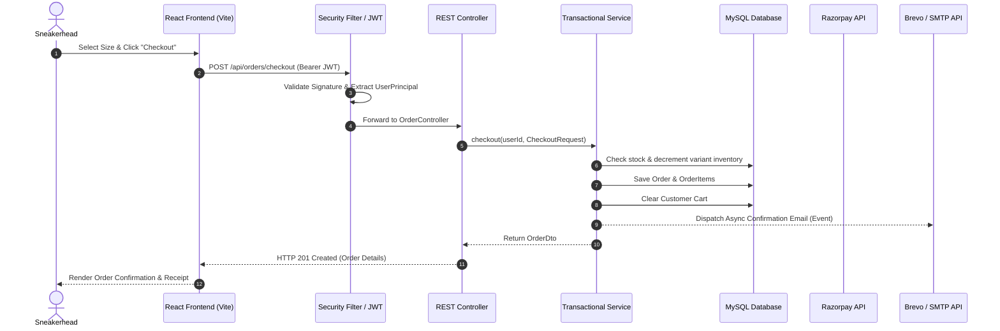

# SneakX — Premium Sneaker E-Commerce Platform

[](https://spring.io/projects/spring-boot)
[](https://react.dev/)
[](https://vitejs.dev/)
[](https://www.mysql.com/)
[](https://render.com/)
[](#testing--verification)

> **SneakX** is an enterprise-grade, full-stack e-commerce marketplace tailored for the global sneakerhead culture. Designed with a streetwear aesthetic, it combines brand-isolated catalog browsing, heuristic-driven size advisory algorithms, atomic order processing with Razorpay, and transactional email fulfillment via Brevo and SMTP.

---

## 🌐 Live Deployments

| Component | Platform | Live URL | Status |
| :--- | :--- | :--- | :--- |
| **Frontend Web Application** | Render | [https://sneakx-frontend.onrender.com](https://sneakx-frontend.onrender.com) |  |
| **Backend REST API** | Render | [https://sneakx-backend-sm4h.onrender.com](https://sneakx-backend-sm4h.onrender.com) |  |
| **API Health Check** | Render | [https://sneakx-backend-sm4h.onrender.com/api/health](https://sneakx-backend-sm4h.onrender.com/api/health) | `{"status":"UP"}` |

### 🔑 Demo Accounts for Quick Evaluation

| Role | Email | Password | Pre-configured Privileges |
| :--- | :--- | :--- | :--- |
| **System Administrator** | `admin@sneakx.in` | `ChangeMe123!` | Access to `/admin` dashboard, order state updates, revenue metrics, stock management |
| **Sample Customer** | `rohan.sharma@sneakx.in` | `ChangeMe123!` | Default shipping address, order history, active wishlist, cart persistence |

---

## 📸 Application Preview

> *Streetwear-inspired dark mode interface with neon accents, fluid transitions, and responsive mobile-first layouts.*

```
+--------------------------------------------------------------------------------------------------+
|  [ SNEAKX ]    BRANDS   CATEGORIES   NEW DROPS   SALE        [ Search sneakers... ]  (Wish) (Cart)|
+--------------------------------------------------------------------------------------------------+
|                                                                                                  |
|   LIMITED EDITION DROP                                     /|       AIR JORDAN 1 CHICAGO         |
|   AIR JORDAN 1 RETRO HIGH OG                              / |       Size: UK 7.5 - UK 11.0       |
|   Iconic silhouette in Varsity Red & White.              /  |       Price: ₹16,999               |
|                                                         /___|       In Stock: 10 units           |
|   [ EXPLORE DROP ]   [ SIZE ADVISOR ]                               [ ADD TO CART ]              |
|                                                                                                  |
+--------------------------------------------------------------------------------------------------+
|  7 CURATED BRAND SILOS                                                                           |
|  [ NIKE ]   [ JORDAN ]   [ ADIDAS ]   [ YEEZY ]   [ NEW BALANCE ]   [ CONVERSE ]   [ PUMA ]      |
+--------------------------------------------------------------------------------------------------+
```

| Desktop View | Mobile Experience | Admin Panel |
| :---: | :---: | :---: |
| *(Hero Carousel, Brand Silos & Grid)* | *(Responsive Bottom Nav & Drawer)* | *(KPI Counters, Charts & Order Triage)* |

*(Screenshots can be added under `assets/screenshots/`)*

---

## ⚡ Key Features

### 1. Isolated Multi-Brand Silos & Catalog Scoping
- **Strict Brand Isolation**: 7 top-tier sneaker brands (*Nike, Jordan, Adidas, Yeezy, New Balance, Converse, Puma*) with zero foreign leaks across queries, sorting, and pagination.
- **Dynamic Compound Filtering**: Combine Brand, Category (*Basketball, Lifestyle, Running, Skateboarding*), Gender, Price Range, and Keyword Search concurrently.
- **Pre-seeded Sneaker Catalog**: 37 authentic silhouettes seeded with accurate retail pricing, colorways, high-resolution galleries, and complete size runs (UK 7.0 – UK 12.0).

### 2. Intelligent Size Advisor (Cross-Brand Heuristic Engine)
- Solves sneakerhead sizing variances (e.g., *Yeezy Boost 350 V2* running +0.5 size small compared to standard Nike sizing).
- Users select their reference sneaker brand and baseline size; the system computes the recommended size with plain-English fit guidance.

### 3. Content-Based Sneaker Recommendations
- Multi-factor affinity scoring algorithm evaluating Category (+3), Brand (+2), Price proximity within 25% (+1), and Gender match (+1).
- Delivers personalized suggestions on detail pages and customer dashboards.

### 4. Robust Cart & Wishlist Lifecycle
- **Real-time Price & Stock Verification**: Prevents overbooking by checking variant inventory on every cart modification.
- **Server-side Persistence**: Carts and wishlists are bound to customer IDs with instant synchronization across devices.

### 5. Multi-Channel Checkout & Payments
- **Razorpay Payment Gateway**: Integration with client-side checkout and backend cryptographic **HMAC-SHA256 signature verification**.
- **Alternative Payment Modes**: Simulated Credit/Debit Card, UPI, and Cash on Delivery (COD).
- **Atomic Transactional Guarantees**: Inventory decrements, cart flushing, and order persistence execute inside a single transactional boundary (`@Transactional`).

### 6. Automated Transactional Emails
- **Brevo REST API v3 Integration**: Sends responsive HTML order confirmation receipts and VIP newsletter welcome emails asynchronously.
- **SMTP Fallback Engine**: Seamlessly falls back to JavaMailSender SMTP (Gmail, SendGrid) or development console logging if external API tokens are omitted.

### 7. Verified Customer Reviews
- **Verified Purchase Enforcement**: Product reviews automatically verify whether the reviewer placed a confirmed order for that specific silhouette.
- **Dynamic Aggregate Calculations**: Rating averages and count tallies update immediately upon submission.

### 8. Admin Control Center
- **Executive KPI Dashboard**: Live tracking of Gross Revenue, Completed Orders, Registered Users, and Low-Stock Warnings (< 3 units).
- **Order Lifecycle Management**: Administrative state machine transitioning orders (`PLACED` &rarr; `CONFIRMED` &rarr; `SHIPPED` &rarr; `DELIVERED` &rarr; `CANCELLED`), with automatic restock on cancellations.

---

## 🛠️ Technology Stack

```
+--------------------------------------------------------------------+
|                         CLIENT TIER                                |
|  React 18 | React Router 6 | Vite 5 | Axios | Lucide React | CSS3   |
+----------------------------------+---------------------------------+
                                   | HTTPS / JSON / JWT
                                   v
+--------------------------------------------------------------------+
|                        APPLICATION TIER                            |
|       Spring Boot 3.3.3 | Spring Security 6 | Spring Data JPA      |
|           Tomcat Embedded | HikariCP | Hibernate ORM               |
+------------------+-------------------------------+-----------------+
                   |                               |
                   v                               v
+----------------------------------+ +-------------------------------+
|           DATA TIER              | |       EXTERNAL SERVICES       |
|  MySQL 8.0 (Aiven Cloud / Local) | |  Razorpay (Payments & HMAC)   |
|  H2 Database (Test Profile)      | |  Brevo API / SMTP (Emails)    |
+----------------------------------+ +-------------------------------+
```

### Backend Architecture
- **Language & Runtime**: Java 17 / Java 21+
- **Framework**: Spring Boot 3.3.3
- **Security**: Spring Security 6 with stateless JWT (`jjwt 0.12.6`), BCrypt password hashing, and role-based access control (`ROLE_USER`, `ROLE_ADMIN`).
- **Persistence**: Spring Data JPA, Hibernate ORM, HikariCP connection pooling.
- **Database**: MySQL 8.x (production), H2 in-memory (automated testing profile).
- **Third-Party Integrations**: Razorpay Java SDK, Brevo Transactional Email API v3, Jakarta Mail.

### Frontend Architecture
- **Framework**: React 18 (Functional components, custom hooks, Context API).
- **Build Tool**: Vite 5 with Hot Module Replacement (HMR).
- **Routing**: React Router v6.
- **Icons & Styling**: Lucide React, Custom Dark Mode / Neon Volt Design System with responsive CSS Grid/Flexbox.
- **HTTP Client**: Axios with centralized request/response interceptors for JWT token injection and error interception.

---

## 🏗️ System Architecture & Data Flow



---

## 📋 API Specification

All API responses follow a consistent envelope structure:
```json
{
  "success": true,
  "message": "Operation description",
  "data": { ... },
  "errors": null,
  "timestamp": "2026-09-24T14:32:00"
}
```

| HTTP Method | Endpoint | Access | Description |
| :--- | :--- | :--- | :--- |
| `GET` | `/api/health` | Public | System uptime & health status check |
| `POST` | `/api/auth/register` | Public | Register new customer account |
| `POST` | `/api/auth/login` | Public | Authenticate user & return signed JWT token |
| `GET` | `/api/auth/me` | Customer / Admin | Retrieve current authenticated user profile |
| `GET` | `/api/products` | Public | Paginated sneaker catalog with multi-filter query params |
| `GET` | `/api/products/{id}` | Public | Full product details including all size variants & inventory |
| `GET` | `/api/products/slug/{slug}` | Public | Retrieve product details by SEO-friendly URL slug |
| `GET` | `/api/products/featured` | Public | Curated list of featured release sneakers |
| `GET` | `/api/products/new-releases` | Public | Newly added sneaker arrivals |
| `GET` | `/api/brands` | Public | List all 7 brand silos with metadata & vector logos |
| `GET` | `/api/categories` | Public | List all product categories |
| `POST` | `/api/recommendations/size-advisor` | Public | Compute recommended shoe size against reference sneaker |
| `GET` | `/api/recommendations/products/{id}` | Public | Content-based recommendations for similar silhouettes |
| `GET` | `/api/cart` | Customer | Fetch current active shopping cart |
| `POST` | `/api/cart/items` | Customer | Add product variant and quantity to cart |
| `PUT` | `/api/cart/items/{id}` | Customer | Update item quantity in cart |
| `DELETE` | `/api/cart/items/{id}` | Customer | Remove specific item from cart |
| `DELETE` | `/api/cart` | Customer | Empty entire active cart |
| `GET` | `/api/wishlist` | Customer | Retrieve customer's saved sneakers |
| `POST` | `/api/wishlist/toggle/{productId}` | Customer | Add or remove sneaker from customer wishlist |
| `GET` | `/api/wishlist/check/{productId}` | Customer | Check if a specific sneaker is saved in wishlist |
| `POST` | `/api/orders/checkout` | Customer | Atomic checkout for cart items (COD / Direct) |
| `GET` | `/api/orders` | Customer | Retrieve order history for current customer |
| `GET` | `/api/orders/{id}` | Customer / Admin | Detailed order breakdown and shipping info |
| `POST` | `/api/payments/create-order` | Customer | Initialize Razorpay payment order |
| `POST` | `/api/payments/verify` | Customer | Verify HMAC-SHA256 payment signature & confirm order |
| `GET` | `/api/products/{id}/reviews` | Public | List all customer reviews for a silhouette |
| `POST` | `/api/products/{id}/reviews` | Customer | Submit verified purchase rating and review |
| `POST` | `/api/newsletter/subscribe` | Public | Subscribe email to VIP drops with automated welcome dispatch |
| `GET` | `/api/admin/dashboard` | Admin Only | Executive summary statistics (Revenue, Orders, Low Stock) |
| `GET` | `/api/admin/orders` | Admin Only | Paginated triage table of all store orders |
| `PUT` | `/api/admin/orders/{id}/status` | Admin Only | Transition order lifecycle (`CONFIRMED`, `SHIPPED`, etc.) |
| `GET` | `/api/admin/users` | Admin Only | List all registered platform customer accounts |
| `POST` | `/api/admin/products` | Admin Only | Create new sneaker silhouette with variants |
| `PUT` | `/api/admin/products/{id}` | Admin Only | Modify sneaker metadata and pricing |
| `DELETE` | `/api/admin/products/{id}` | Admin Only | Soft-delete / deactivate product from catalog |
| `PUT` | `/api/admin/variants/{id}/stock` | Admin Only | Update live stock counts for a specific size SKU |

---

## 🧪 Testing & Verification

SneakX maintains strict verification standards with multi-layer test coverage:

```
==========================================================
 SneakX Automated Test Execution Summary
==========================================================
 Total Automated Tests Executed:  77
 Total Passing:                   77 (100% Pass Rate)
 Total Failures / Regressions:    0
==========================================================
```

### 1. Backend Integration & Unit Tests (`31 Passing`)
Executed via `mvn test` utilizing JUnit 5, Mockito, and Spring Boot Context:
- **`ProductIsolationAndOrderTest`**: Verifies strict 100% brand isolation across all 7 brands, compound brand/category queries, brand/search, and brand/sort combinations without cross-brand leaks.
- **`PaymentServiceTest`**: Validates cryptographic HMAC-SHA256 signature generation, validation, and malicious tampering rejection.
- **`SizeAdvisorServiceTest`**: Tests half-size-up (+0.5), true-to-size, and half-size-down heuristic rules.
- **`OrderConfirmationEmailTest`**: Tests transactional email generation across COD, Card, and UPI payments.
- **`BrevoEmailTest`**: Verifies Brevo v3 API payload formatting and fallback safety.
- **`JwtTokenProviderTest`**: Tests token generation, claim extraction, expiry enforcement, and tampering security.
- **`CorsSecurityTest`**: Verifies CORS pre-flight `OPTIONS` handshakes and headers.

### 2. Live Runtime User Journeys (`46 Passing`)
Executed live against running Spring Boot and Vite servers with active MySQL connectivity:
- ✅ Health check & server ping
- ✅ Admin & Customer authentication + JWT issuance
- ✅ New customer registration & BCrypt hashing
- ✅ Unauthenticated route blocking (HTTP 403)
- ✅ Customer blocked from Admin control panel (RBAC HTTP 403 Forbidden)
- ✅ 7 brand isolation checks (Nike, Jordan, Adidas, Yeezy, New Balance, Converse, Puma)
- ✅ Compound brand & category filtering (`Jordan + Basketball`)
- ✅ Search keyword scoping (`'Air'`)
- ✅ Dynamic price sort validation (ascending/descending)
- ✅ Size Advisor computation with brand-to-brand offset
- ✅ Content similarity recommendations (4 matched sneakers)
- ✅ Cart item addition, quantity modification, and subtotal calculation
- ✅ Wishlist toggle, state check, and item retrieval
- ✅ Atomic order placement via Cash on Delivery
- ✅ Inventory variant decrement upon checkout
- ✅ Cart auto-clearing post checkout
- ✅ Customer order history retrieval
- ✅ Customer review posting with verified purchaser badge
- ✅ Admin KPI statistics retrieval
- ✅ Admin order status transition (`PLACED` &rarr; `CONFIRMED` &rarr; `SHIPPED`)
- ✅ Admin customer list auditing
- ✅ Newsletter subscription with Brevo API dispatch and duplicate idempotency

---

## 💻 Local Setup & Installation

### Prerequisites
- **Java Development Kit (JDK)**: Version 17 or 21+ (`java -version`)
- **Apache Maven**: Version 3.8+ (`mvn -version` or use provided `./mvnw.cmd`)
- **Node.js**: Version 18.0.0+ (`node -v`)
- **npm**: Version 9.0.0+ (`npm -v`)
- **MySQL Server**: Version 8.0+ running locally on port 3306

---

### Step 1: Clone Repository
```bash
git clone https://github.com/om-rindhe24/sneakx-ecommerce.git
cd sneakx-ecommerce
```

---

### Step 2: Backend Configuration & Startup

1. **Create MySQL Database**:
   ```sql
   CREATE DATABASE IF NOT EXISTS sneakx_db;
   ```

2. **Configure Environment Variables**:  
   Create an environment configuration or provide environment variables:

   | Variable Name | Description | Default / Example Value |
   | :--- | :--- | :--- |
   | `DB_HOST` | MySQL hostname | `localhost` |
   | `DB_PORT` | MySQL port | `3306` |
   | `DB_NAME` | Database name | `sneakx_db` |
   | `DB_USERNAME` | MySQL user | `root` |
   | `DB_PASSWORD` | MySQL user password | *(your local password)* |
   | `DB_SSL_MODE` | SSL requirement | `PREFERRED` (or `REQUIRED` for cloud) |
   | `JWT_SECRET` | 256-bit signing key | *(min 32 character secret)* |
   | `JWT_EXPIRATION` | Token expiry in ms | `86400000` (24 hours) |
   | `PORT` | Server listening port | `8080` |
   | `FRONTEND_URL` | Allowed CORS origin | `http://localhost:5173` |
   | `BREVO_API_KEY` | *(Optional)* Brevo v3 key | `xkeysib-...` |
   | `BREVO_FROM_EMAIL`| *(Optional)* Verified sender | `orders@sneakx.com` |
   | `MAIL_HOST` | *(Optional)* SMTP host | `smtp.gmail.com` |
   | `MAIL_PORT` | *(Optional)* SMTP port | `587` |
   | `MAIL_USERNAME` | *(Optional)* SMTP user | `your-email@gmail.com` |
   | `MAIL_PASSWORD` | *(Optional)* SMTP app password | `your-16-char-app-password` |
   | `RAZORPAY_KEY_ID` | *(Optional)* Razorpay Key ID | `rzp_test_...` |
   | `RAZORPAY_KEY_SECRET` | *(Optional)* Razorpay Secret | `...` |

   > **Note on Email & Payments**: If `BREVO_API_KEY` and `MAIL_HOST` are omitted, SneakX operates in **Safe Development Fallback Mode**, generating formatted order receipts directly to server console logs without crashing.

3. **Build & Run Backend**:
   ```bash
   cd backend
   mvn clean spring-boot:run
   ```
   *The backend will boot on `http://localhost:8080`. Seed data (37 sneakers, 7 brands, admin, and customer accounts) loads automatically on first boot.*

---

### Step 3: Frontend Configuration & Startup

1. **Navigate to Frontend Directory**:
   ```bash
   cd ../frontend
   ```

2. **Configure `.env`**:  
   Create `frontend/.env`:
   ```properties
   VITE_API_BASE_URL=http://localhost:8080/api
   ```

3. **Install Dependencies & Start Dev Server**:
   ```bash
   npm install
   npm run dev
   ```
   *The application will be accessible at `http://localhost:5173`.*

---

### Step 4: Production Build Validation

```bash
# Frontend bundle verification
cd frontend
npm run build

# Backend package verification
cd ../backend
mvn clean package -DskipTests
```

---

## 🔮 Future Enhancements

- [ ] **Redis Caching Layer**: Cache hot product queries and brand catalog listings to achieve sub-10ms response times.
- [ ] **Elasticsearch / Typesense Integration**: Instant fuzzy search with typo tolerance and auto-suggestions.
- [ ] **Webhook Event Listeners**: Asynchronous webhook handler for Razorpay payment captures and refunds.
- [ ] **Sneaker Drop Raffles**: Fair-queue randomized raffle lottery system for hyper-limited releases.
- [ ] **3D Sneaker Inspector**: Three.js / WebGL interactive 360-degree sneaker previewer.
- [ ] **Multi-Currency & International Shipping**: Dynamic currency switcher with real-time conversion rates.

---

## 👨‍💻 Author & Contact

**Om Rindhe**  
Full-Stack Software Engineer  
- **GitHub**: [@om-rindhe24](https://github.com/om-rindhe24)  
- **Email**: [rindheom261@gmail.com](mailto:rindheom261@gmail.com)  
- **Repository**: [https://github.com/om-rindhe24/sneakx-ecommerce](https://github.com/om-rindhe24/sneakx-ecommerce)

---

## 📄 License

This project is licensed under the **MIT License** — feel free to explore, clone, and build upon it.
