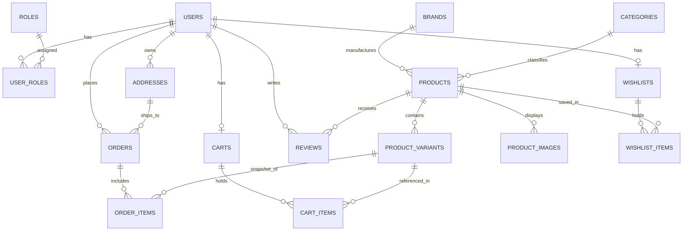

# SneakX — Relational Database Architecture & Schema Design

## 1. Database Specifications
- **Engine**: MySQL 8.0+ (InnoDB)
- **Charset**: `utf8mb4`
- **Collation**: `utf8mb4_unicode_ci`
- **Design Normalization**: Third Normal Form (3NF)

---

## 2. Entity-Relationship Overview



---

## 3. Table Schemas & Relational Specifications

### 3.1 `roles`
Stores authorization role definitions.
| Column | Type | Constraints | Description |
| :--- | :--- | :--- | :--- |
| `id` | `BIGINT` | `PK, AUTO_INCREMENT` | Unique Role ID |
| `name` | `VARCHAR(30)` | `NOT NULL, UNIQUE` | Role name (`ROLE_USER`, `ROLE_ADMIN`) |

### 3.2 `users`
Stores registered customer and admin credentials.
| Column | Type | Constraints | Description |
| :--- | :--- | :--- | :--- |
| `id` | `BIGINT` | `PK, AUTO_INCREMENT` | Unique User ID |
| `first_name` | `VARCHAR(50)` | `NOT NULL` | User first name |
| `last_name` | `VARCHAR(50)` | `NOT NULL` | User last name |
| `email` | `VARCHAR(100)` | `NOT NULL, UNIQUE` | Unique login email address |
| `password_hash`| `VARCHAR(255)` | `NOT NULL` | Salted BCrypt password hash |
| `phone` | `VARCHAR(20)` | `NULL` | Contact phone number |
| `created_at` | `DATETIME` | `NOT NULL, DEFAULT CURRENT_TIMESTAMP` | Account creation timestamp |
| `updated_at` | `DATETIME` | `NOT NULL, ON UPDATE CURRENT_TIMESTAMP` | Last profile update |

### 3.3 `user_roles`
Join table mapping users to roles (Many-to-Many).
| Column | Type | Constraints | Description |
| :--- | :--- | :--- | :--- |
| `user_id` | `BIGINT` | `PK, FK -> users(id) ON DELETE CASCADE` | Reference to User |
| `role_id` | `BIGINT` | `PK, FK -> roles(id) ON DELETE CASCADE` | Reference to Role |

### 3.4 `addresses`
Stores shipping addresses associated with users.
| Column | Type | Constraints | Description |
| :--- | :--- | :--- | :--- |
| `id` | `BIGINT` | `PK, AUTO_INCREMENT` | Unique Address ID |
| `user_id` | `BIGINT` | `NOT NULL, FK -> users(id) ON DELETE CASCADE` | Address owner |
| `full_name` | `VARCHAR(100)` | `NOT NULL` | Recipient full name |
| `phone` | `VARCHAR(20)` | `NOT NULL` | Delivery contact phone |
| `street_address`| `VARCHAR(255)` | `NOT NULL` | Street address line |
| `city` | `VARCHAR(50)` | `NOT NULL` | City name |
| `state` | `VARCHAR(50)` | `NOT NULL` | State or province |
| `postal_code` | `VARCHAR(20)` | `NOT NULL` | Postal / PIN code |
| `country` | `VARCHAR(50)` | `NOT NULL, DEFAULT 'India'` | Country name |
| `is_default` | `BOOLEAN` | `DEFAULT FALSE` | Default checkout address flag |

### 3.5 `brands`
Footwear manufacturers and labels (e.g. Nike, Jordan, Adidas, New Balance).
| Column | Type | Constraints | Description |
| :--- | :--- | :--- | :--- |
| `id` | `BIGINT` | `PK, AUTO_INCREMENT` | Unique Brand ID |
| `name` | `VARCHAR(50)` | `NOT NULL, UNIQUE` | Brand name |
| `slug` | `VARCHAR(50)` | `NOT NULL, UNIQUE` | URL-friendly slug |
| `logo_url` | `VARCHAR(255)` | `NULL` | Brand logo image asset |

### 3.6 `categories`
Footwear classification categories (e.g. Basketball, Running, Lifestyle, Retro).
| Column | Type | Constraints | Description |
| :--- | :--- | :--- | :--- |
| `id` | `BIGINT` | `PK, AUTO_INCREMENT` | Unique Category ID |
| `name` | `VARCHAR(50)` | `NOT NULL, UNIQUE` | Category name |
| `slug` | `VARCHAR(50)` | `NOT NULL, UNIQUE` | URL-friendly slug |
| `description` | `TEXT` | `NULL` | Short category description |

### 3.7 `products`
Master sneaker silhouettes and models.
| Column | Type | Constraints | Description |
| :--- | :--- | :--- | :--- |
| `id` | `BIGINT` | `PK, AUTO_INCREMENT` | Unique Product ID |
| `brand_id` | `BIGINT` | `NOT NULL, FK -> brands(id)` | Manufacturer reference |
| `category_id` | `BIGINT` | `NOT NULL, FK -> categories(id)` | Category reference |
| `name` | `VARCHAR(150)` | `NOT NULL` | Sneaker name (e.g., Air Jordan 1 High OG) |
| `slug` | `VARCHAR(180)` | `NOT NULL, UNIQUE` | SEO-friendly URL slug |
| `description` | `TEXT` | `NOT NULL` | Detailed marketing & design story |
| `base_price` | `DECIMAL(10,2)`| `NOT NULL` | Base retail price |
| `colorway` | `VARCHAR(100)` | `NOT NULL` | Official colorway (e.g., "Chicago / Lost & Found") |
| `gender` | `VARCHAR(20)` | `NOT NULL, DEFAULT 'Unisex'` | Target demographic (`Men`, `Women`, `Unisex`) |
| `is_featured` | `BOOLEAN` | `DEFAULT FALSE` | Spotlight on homepage |
| `is_active` | `BOOLEAN` | `DEFAULT TRUE` | Soft-deletion flag |
| `created_at` | `DATETIME` | `NOT NULL, DEFAULT CURRENT_TIMESTAMP` | Date added |
| `updated_at` | `DATETIME` | `NOT NULL, ON UPDATE CURRENT_TIMESTAMP` | Last updated |

### 3.8 `product_variants`
Tracks individual shoe sizes, physical stock, and SKUs.
| Column | Type | Constraints | Description |
| :--- | :--- | :--- | :--- |
| `id` | `BIGINT` | `PK, AUTO_INCREMENT` | Unique Variant ID |
| `product_id` | `BIGINT` | `NOT NULL, FK -> products(id) ON DELETE CASCADE` | Parent sneaker |
| `size` | `DECIMAL(3,1)` | `NOT NULL` | US Footwear size (e.g. 7.5, 8.0, 10.5) |
| `sku` | `VARCHAR(60)` | `NOT NULL, UNIQUE` | Stock Keeping Unit code |
| `stock_quantity`| `INT` | `NOT NULL, DEFAULT 0` | Available unsold units |
| `price_adjustment`| `DECIMAL(10,2)`| `NOT NULL, DEFAULT 0.00` | Price delta from base price |

### 3.9 `product_images`
Product photo gallery.
| Column | Type | Constraints | Description |
| :--- | :--- | :--- | :--- |
| `id` | `BIGINT` | `PK, AUTO_INCREMENT` | Unique Image ID |
| `product_id` | `BIGINT` | `NOT NULL, FK -> products(id) ON DELETE CASCADE` | Associated product |
| `image_url` | `VARCHAR(500)` | `NOT NULL` | URL or asset path |
| `is_primary` | `BOOLEAN` | `DEFAULT FALSE` | Main thumbnail card image |
| `display_order`| `INT` | `DEFAULT 0` | Ordering index in gallery |

### 3.10 `carts` & `cart_items`
User shopping carts.
| Table | Column | Type | Constraints | Description |
| :--- | :--- | :--- | :--- | :--- |
| `carts` | `id` | `BIGINT` | `PK, AUTO_INCREMENT` | Unique Cart ID |
| `carts` | `user_id` | `BIGINT` | `NOT NULL, UNIQUE, FK -> users(id)` | 1-to-1 Cart per user |
| `cart_items` | `id` | `BIGINT` | `PK, AUTO_INCREMENT` | Line item ID |
| `cart_items` | `cart_id` | `BIGINT` | `NOT NULL, FK -> carts(id) ON DELETE CASCADE` | Cart reference |
| `cart_items` | `variant_id` | `BIGINT` | `NOT NULL, FK -> product_variants(id)` | Selected sneaker size |
| `cart_items` | `quantity` | `INT` | `NOT NULL, DEFAULT 1` | Selected quantity |

### 3.11 `wishlists` & `wishlist_items`
Saved items for authenticated users.
| Table | Column | Type | Constraints | Description |
| :--- | :--- | :--- | :--- | :--- |
| `wishlists` | `id` | `BIGINT` | `PK, AUTO_INCREMENT` | Unique Wishlist ID |
| `wishlists` | `user_id` | `BIGINT` | `NOT NULL, UNIQUE, FK -> users(id)` | 1-to-1 Wishlist per user |
| `wishlist_items`| `id` | `BIGINT` | `PK, AUTO_INCREMENT` | Item ID |
| `wishlist_items`| `wishlist_id`| `BIGINT` | `NOT NULL, FK -> wishlists(id) ON DELETE CASCADE`| Wishlist reference |
| `wishlist_items`| `product_id` | `BIGINT` | `NOT NULL, FK -> products(id)` | Bookmarked sneaker |

### 3.12 `orders` & `order_items`
Transactional checkout and purchasing history.
| Table | Column | Type | Constraints | Description |
| :--- | :--- | :--- | :--- | :--- |
| `orders` | `id` | `BIGINT` | `PK, AUTO_INCREMENT` | Internal Order ID |
| `orders` | `order_number` | `VARCHAR(36)` | `NOT NULL, UNIQUE` | Public tracking UUID |
| `orders` | `user_id` | `BIGINT` | `NOT NULL, FK -> users(id)` | Buyer reference |
| `orders` | `address_id` | `BIGINT` | `NOT NULL, FK -> addresses(id)` | Shipping destination |
| `orders` | `total_amount` | `DECIMAL(10,2)`| `NOT NULL` | Final billed amount |
| `orders` | `status` | `VARCHAR(30)` | `NOT NULL, DEFAULT 'PENDING'` | `PENDING`, `CONFIRMED`, `SHIPPED`, `DELIVERED`, `CANCELLED` |
| `orders` | `payment_method`| `VARCHAR(30)` | `NOT NULL, DEFAULT 'COD'` | Payment type (`SIMULATED_CARD`, `SIMULATED_UPI`, `COD`) |
| `orders` | `payment_status`| `VARCHAR(30)` | `NOT NULL, DEFAULT 'PENDING'`| `PENDING`, `PAID`, `FAILED` |
| `orders` | `payment_reference`| `VARCHAR(100)`| `NULL` | Safe gateway/transaction reference ID |
| `orders` | `created_at` | `DATETIME` | `NOT NULL, DEFAULT CURRENT_TIMESTAMP` | Order timestamp |
| `order_items` | `id` | `BIGINT` | `PK, AUTO_INCREMENT` | Line item ID |
| `order_items` | `order_id` | `BIGINT` | `NOT NULL, FK -> orders(id) ON DELETE CASCADE`| Parent Order |
| `order_items` | `variant_id` | `BIGINT` | `NOT NULL, FK -> product_variants(id)` | Purchased size variant |
| `order_items` | `product_name` | `VARCHAR(150)`| `NOT NULL` | Immutable snapshot of name |
| `order_items` | `size` | `DECIMAL(3,1)` | `NOT NULL` | Immutable snapshot of size |
| `order_items` | `price` | `DECIMAL(10,2)`| `NOT NULL` | Immutable price charged |
| `order_items` | `quantity` | `INT` | `NOT NULL` | Units ordered |

### 3.13 `reviews`
Verified customer ratings and commentary.
| Column | Type | Constraints | Description |
| :--- | :--- | :--- | :--- |
| `id` | `BIGINT` | `PK, AUTO_INCREMENT` | Unique Review ID |
| `user_id` | `BIGINT` | `NOT NULL, FK -> users(id)` | Reviewer |
| `product_id` | `BIGINT` | `NOT NULL, FK -> products(id)` | Target sneaker |
| `rating` | `TINYINT` | `NOT NULL, CHECK (rating BETWEEN 1 AND 5)` | Star rating |
| `title` | `VARCHAR(120)` | `NOT NULL` | Short review summary |
| `comment` | `TEXT` | `NOT NULL` | Review body |
| `is_verified_purchase` | `BOOLEAN` | `DEFAULT TRUE` | Set to true if verified via order |
| `created_at` | `DATETIME` | `NOT NULL, DEFAULT CURRENT_TIMESTAMP` | Post timestamp |

---

## 4. Key Indexes for High Performance

```sql
-- Fast lookups by brand and category in catalog
CREATE INDEX idx_products_brand_id ON products(brand_id);
CREATE INDEX idx_products_category_id ON products(category_id);
CREATE INDEX idx_products_slug ON products(slug);

-- Fast variant lookups during size selection & inventory checks
CREATE INDEX idx_variants_product_id ON product_variants(product_id);
CREATE INDEX idx_variants_sku ON product_variants(sku);

-- Customer order history queries
CREATE INDEX idx_orders_user_id ON orders(user_id);
CREATE INDEX idx_orders_created_at ON orders(created_at);

-- Product reviews aggregation
CREATE INDEX idx_reviews_product_id ON reviews(product_id);
```

---

## 5. Critical Database Transactions

### Atomic Inventory Checkout
```sql
-- 1. Check & lock variant inventory row
SELECT stock_quantity FROM product_variants WHERE id = :variantId FOR UPDATE;

-- 2. Deduct inventory if stock_quantity >= :orderQuantity
UPDATE product_variants
SET stock_quantity = stock_quantity - :orderQuantity
WHERE id = :variantId AND stock_quantity >= :orderQuantity;

-- 3. Record order and line items
INSERT INTO orders (...) VALUES (...);
INSERT INTO order_items (...) VALUES (...);
```
